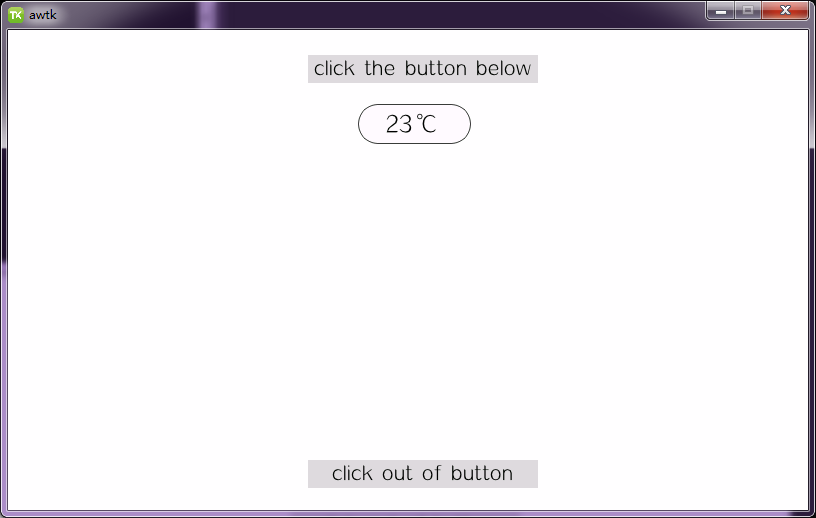

# awtk-widget-button_ex

button_ex 控件。



## 准备

1. 获取 awtk 并编译

```
git clone https://github.com/zlgopen/awtk.git
cd awtk; scons; cd -
```

## 运行

1. 生成示例代码的资源

```
python scripts/update_res.py all
```
> 也可以使用 Designer 打开项目，之后点击 “打包” 按钮进行生成；
> 如果资源发生修改，则需要重新生成资源。

如果 PIL 没有安装，执行上述脚本可能会出现如下错误：
```cmd
Traceback (most recent call last):
...
ModuleNotFoundError: No module named 'PIL'
```
请用 pip 安装：
```cmd
pip install Pillow
```

2. 编译

```
Usage: scons SHARED[true|false] IDL_DEF[true|false] LCD[800_480|...]
Example:
scons SHARED=false
scons IDL_DEF=false
scons LCD=480_272
scons SHARED=false IDL_DEF=false LCD=480_272
```
参数 SHARED 是可选的，用于指定是否编译生成动态库，缺省为true。
参数 IDL_DEF 是可选的，用于指定编译前是否重新生成idl.json和def文件，缺省为true。
参数 LCD 是可选的，用于指定示例程序运行时的LCD尺寸，格式为“height_width”。
> 注意：编译前先确定SConstruct 文件中的 awtk_root 为 awtk 所在目录，否则会编译失败。

3. 运行

```
./bin/demo
```

## 文档

[完善自定义控件](https://github.com/zlgopen/awtk-widget-generator/blob/master/docs/improve_generated_widget.md)
