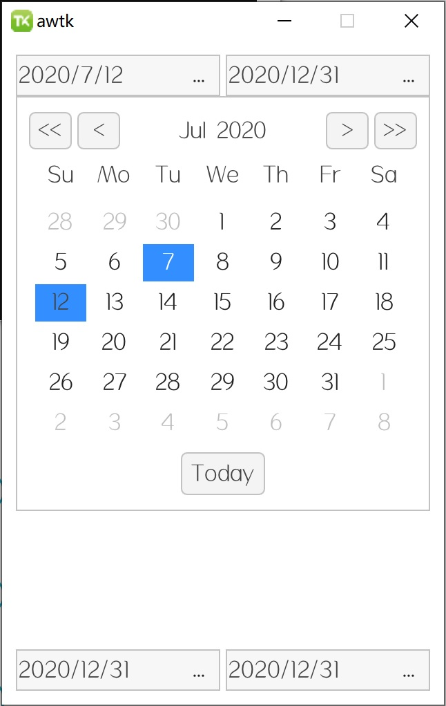
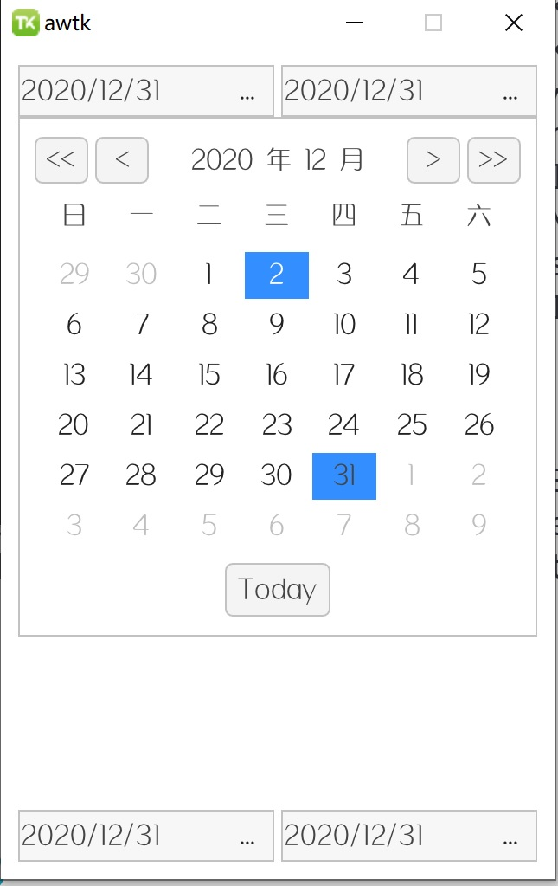

# awtk-widget-date-picker

日期选择控件。

> 默认界面比较朴素，请根据应用程序的风格，自己进行调整。

英文界面：



中文界面：



## 准备

1. 获取 awtk 并编译

```
git clone https://github.com/zlgopen/awtk.git
cd awtk; scons; cd -
```

## 运行

1. 生成示例代码的资源

```
python scripts/update_res.py all
```
> 也可以使用 Designer 打开项目，之后点击 “打包” 按钮进行生成；
> 如果资源发生修改，则需要重新生成资源。

如果 PIL 没有安装，执行上述脚本可能会出现如下错误：
```cmd
Traceback (most recent call last):
...
ModuleNotFoundError: No module named 'PIL'
```
请用 pip 安装：
```cmd
pip install Pillow
```

2. 编译

* 编译PC版本

```
scons
```

* 编译LINUX FB版本

```
scons LINUX_FB=true
```

> 完整编译选项请参考[编译选项](https://github.com/zlgopen/awtk-widget-generator/blob/master/docs/build_options.md)

3. 运行

```
./bin/demo
```

## 文档

### 基本用法

date\_edit 需要两个特殊名称的子控件，它们的名称和功能如下： 
  
 * date 用于显示和编辑日期，通常用 edit 控件，并指定 input type 为"date"
 * pick 用于点击后弹出日期选择控件。通常用 button 控件。点击 pick 按钮后，会打开名为"date_picker"的弹出窗口。
  
> 子控件的大小和风格可以自行设定，遵循命名规则即可。

示例：

```xml
  <date_edit name="d1" x="10" y="10" w="148" h="30" year="2020" month="12" day="31">
    <edit name="date" x="0" y="m" w="100%" h="100%" input_type="date" />
    <button name="pick" style="pick" x="r:2" y="m" w="26" h="26" text="..." />
  </date_edit
```

> 完整示例请参考: main.xml

注册日期变化事件：

```c
static ret_t on_date_changed(void* ctx, event_t* e) {
  widget_t* widget = WIDGET(e->target);
  date_edit_t* date_edit = DATE_EDIT(widget);

  log_debug("%d/%d/%d\n", date_edit->year, date_edit->month, date_edit->day);

  return RET_OK;
}

...
  widget_child_on(win, "d1", EVT_VALUE_CHANGED, on_date_changed, NULL); 
````

> 完整示例请参考: window_main.c

### 弹出窗口

弹出的日期选择窗口名称为 date_picker，可以根据自己的情况定制（主要是设置控件的显示风格）。

其内容如下：

```xml
<popup theme="date_picker" w="300" h="300" close_when_click_outside="true">
  <date_picker x="c" y="m" w="280" h="280">
    <row name="title" x="0" y="0" w="100%" h="30">
      <button name="prev_year" x="0" y="m" w="30" h="26" text="<<"/>
      <button name="prev_month" x="35" y="m" w="30" h="26" text="<"/>
      <label name="year_month" x="c" y="m" w="50%" h="100%" text="2020/7"/>
      <button name="next_month" x="r:35" y="m" w="30" h="26" text=">"/>
      <button name="next_year" x="r" y="m" w="30" h="26" text=">>"/>
    </row>

    <row name="week" x="0" y="32" w="100%" h="30" children_layout="default(r=1,c=7,m=2,s=2)">
      <label name="sun" tr_text="Su"/>
      <label name="mon" tr_text="Mo"/>
      <label name="tue" tr_text="Tu"/>
      <label name="wed" tr_text="We"/>
      <label name="thu" tr_text="Th"/>
      <label name="fri" tr_text="Fr"/>
      <label name="sat" tr_text="Sa"/>
    </row>

    <grid name="days" x="0" y="64" w="100%" h="-100" children_layout="default(r=6,c=7,m=2,s=2)">
      <button text="0"/>
      <button text="1"/>
      <button text="2"/>
      <button text="3"/>
      <button text="4"/>
      <button text="5"/>
      <button text="6"/>
      
      <button text="0"/>
      <button text="1"/>
      <button text="2"/>
      <button text="3"/>
      <button text="4"/>
      <button text="5"/>
      <button text="6"/>
      
      <button text="0"/>
      <button text="1"/>
      <button text="2"/>
      <button text="3"/>
      <button text="4"/>
      <button text="5"/>
      <button text="6"/>

      <button text="0"/>
      <button text="1"/>
      <button text="2"/>
      <button text="3"/>
      <button text="4"/>
      <button text="5"/>
      <button text="6"/>

      <button text="0"/>
      <button text="1"/>
      <button text="2"/>
      <button text="3"/>
      <button text="4"/>
      <button text="5"/>
      <button text="6"/>

      <button text="0"/>
      <button text="1"/>
      <button text="2"/>
      <button text="3"/>
      <button text="4"/>
      <button text="5"/>
      <button text="6"/>
    </grid>
    <button name="today" x="c" y="b:2" w="60" h="30" tr_text="Today">
  </date_picker>
</popup>

```

### 需要翻译的字符串

请参考 strings.xml

### 其它文档

[完善自定义控件](https://github.com/zlgopen/awtk-widget-generator/blob/master/docs/improve_generated_widget.md)
