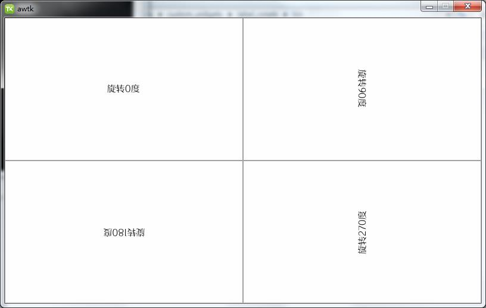

# label_rotate

​	由于 AWTK 没有可以旋转的文本控件，所以 label_rotate 控件是为了解决该问题的，label_rotate 控件和普通的 label 控件的用法基本上是一样的。

​	其中在 UI 中只需要配置 orientation 属性即可以设置该旋转方向了。

```xml
  <view x="0" y="0" w="100%" h="100%" children_layout="default(c=2,r=2)">
    <label_rotate orientation="orientation_0" text="旋转0度"/>
    <label_rotate orientation="orientation_90" text="旋转90度"/>
    <label_rotate orientation="orientation_180" text="旋转180度"/>
    <label_rotate orientation="orientation_270" text="旋转270度"/>
  </view>
```



> 备注：具体可以看 docs 文件夹中的文档

## 准备

1. 获取 awtk 并编译

```
git clone https://github.com/zlgopen/awtk.git
cd awtk; scons; cd -
```

## 运行

1. 生成示例代码的资源

```
python scripts/update_res.py all
```
> 也可以使用 Designer 打开项目，之后点击 “打包” 按钮进行生成；
> 如果资源发生修改，则需要重新生成资源。

如果 PIL 没有安装，执行上述脚本可能会出现如下错误：
```cmd
Traceback (most recent call last):
...
ModuleNotFoundError: No module named 'PIL'
```
请用 pip 安装：
```cmd
pip install Pillow
```

2. 编译

```
scons
```
> 注意：
> 编译前先确认 SConstruct 文件中的 awtk_root 是否为 awtk 所在目录，不是则修改。
> 默认使用动态库的形式，如果需要使用静态库，修改 SConstruct 文件中的 BUILD_SHARED = 'false' 即可。

3. 运行
```
./bin/demo
```

## 文档

[AWTK 自定义控件规范](https://github.com/zlgopen/awtk/blob/master/docs/custom_widget_rules.md)
