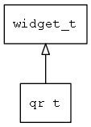

## qr\_t
### 概述


显示二维码的控件
qr\_t是[widget\_t](widget_t.md)的子类控件，widget\_t的函数均适用于qr\_t控件。

在xml中使用"qr"标签创建数值文本控件。如：

```xml
<!-- ui -->
<qr x="c" y="m" w="240" h="240" value="https://github.com/zlgopen/awtk"/>
```
在c代码中使用函数qr\_create创建数值文本控件。如：

```c
widget_t* qr = qr_create(win, 10, 10, 128, 128);
```
可用通过style来设置控件的显示风格，如字体的大小和颜色等等。如：

```xml
<!-- style -->
<qr>
<style name="default" >
<normal fg_color="black" bg_color="white" bg_image="message"/>
<disable fg_color="gray" bg_color="#f0f0f0"/>
</style>
</qr>
```
----------------------------------
### 函数
<p id="qr_t_methods">

| 函数名称 | 说明 | 
| -------- | ------------ | 
| <a href="#qr_t_qr_cast">qr\_cast</a> | 转换为qr对象(供脚本语言使用)。 |
| <a href="#qr_t_qr_create">qr\_create</a> | 创建qr对象 |
| <a href="#qr_t_qr_set_value">qr\_set\_value</a> | 设置要转成二维码的字符串。 |
### 属性
<p id="qr_t_properties">

| 属性名称 | 类型 | 说明 | 
| -------- | ----- | ------------ | 
| <a href="#qr_t_value">value</a> | char* | 要转成二维码的字符串。值。 |
#### qr\_cast 函数
-----------------------

* 函数功能：

> <p id="qr_t_qr_cast">转换为qr对象(供脚本语言使用)。

* 函数原型：

```
widget_t* qr_cast (widget_t* widget);
```

* 参数说明：

| 参数 | 类型 | 说明 |
| -------- | ----- | --------- |
| 返回值 | widget\_t* | qr对象。 |
| widget | widget\_t* | qr对象。 |
#### qr\_create 函数
-----------------------

* 函数功能：

> <p id="qr_t_qr_create">创建qr对象

* 函数原型：

```
widget_t* qr_create (widget_t* parent, xy_t x, xy_t y, wh_t w, wh_t h);
```

* 参数说明：

| 参数 | 类型 | 说明 |
| -------- | ----- | --------- |
| 返回值 | widget\_t* | qr对象。 |
| parent | widget\_t* | 父控件 |
| x | xy\_t | x坐标 |
| y | xy\_t | y坐标 |
| w | wh\_t | 宽度 |
| h | wh\_t | 高度 |
#### qr\_set\_value 函数
-----------------------

* 函数功能：

> <p id="qr_t_qr_set_value">设置要转成二维码的字符串。

* 函数原型：

```
ret_t qr_set_value (widget_t* widget, const char* value);
```

* 参数说明：

| 参数 | 类型 | 说明 |
| -------- | ----- | --------- |
| 返回值 | ret\_t | 返回RET\_OK表示成功，否则表示失败。 |
| widget | widget\_t* | widget对象。 |
| value | const char* | 格式字符串。 |
#### value 属性
-----------------------
> <p id="qr_t_value">要转成二维码的字符串。值。

* 类型：char*

| 特性 | 是否支持 |
| -------- | ----- |
| 可直接读取 | 是 |
| 可直接修改 | 否 |
| 可持久化   | 是 |
| 可脚本化   | 是 |
| 可在IDE中设置 | 是 |
| 可在XML中设置 | 是 |
| 可通过widget\_get\_prop读取 | 是 |
| 可通过widget\_set\_prop修改 | 是 |
