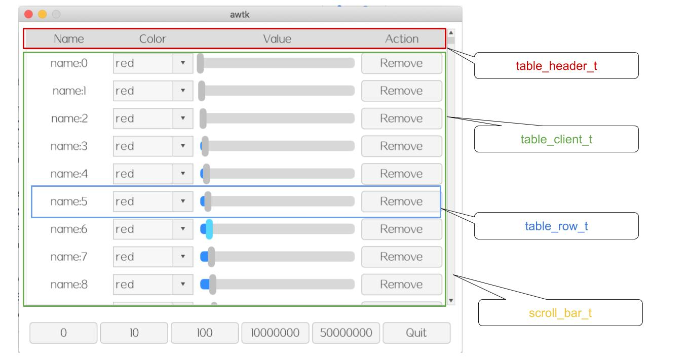
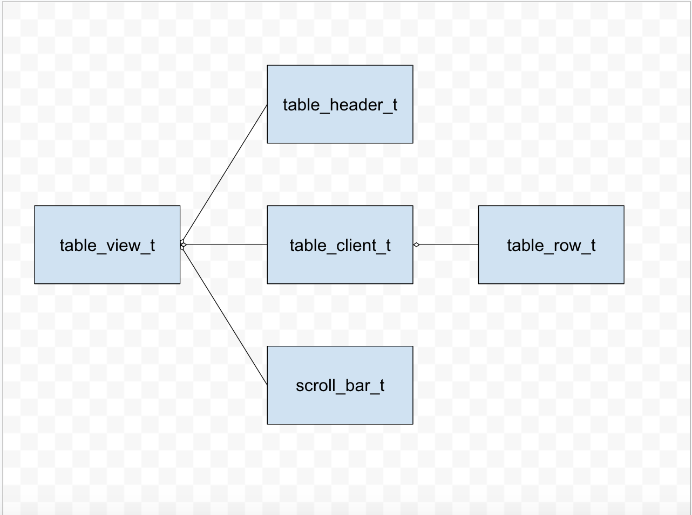
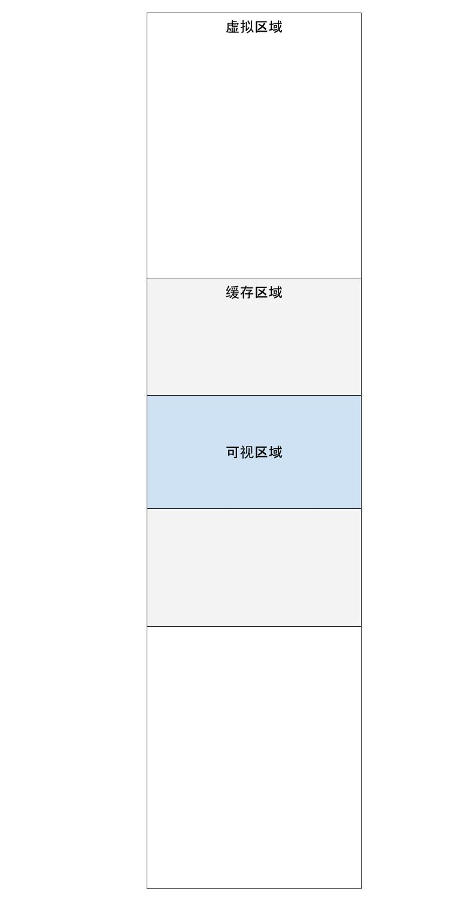

# 表格视图的基本用法

## 1. 基本概念



* table\_view\_t 是表格视图的外壳，它的主要功能是协调 table\_client\_t 和滚动条。

* table\_header\_t 是表格的标题，它其实只是一个普通的容器，完全可以用 view 代替，但用 table\_header\_t 更具可读性。

* table\_client\_t 是表格的数据区，它是一个 table\_row\_t 的容器。

* table\_row\_t 表示表格中的一行，它只是个容器，里面可以文本、图片、编辑器、进度条、滑块和下拉框等各种控件。



table\_view\_t 的为了解决大量数据的问题，我们把数据分为三类：

* 虚拟区域。代表全部数据，它是虚拟的，无需加入到内存中来。

* 缓存区域。代表实际在内存中创建的部分，为了让滑动效果比较流畅，缓存区域是可视区域的 3 倍。

* 可视区域。代表当前呈现在窗口上的部分。



当拖到滚动条改变可视区域时，如果可视区域超出缓存区域，则调用用户提供的回调函数，更新缓存区域的位置和数据。

## 2. 用法

## 2.1 编写 XML

table\_view 由 table\_header（可选）、table\_client 和 scroll\_bar 组成。

在 table\_client 中，只需要写一个 table\_row，这个 table\_row 只是作为模版，由 table\_client 根据需要创建。

示例：

```xml
  <table_view x="10" y="10" w="-20" h="-80">
    <table_header x="0"  y="0" w="-12" h="30" name="title" children_layout="default(r=1,c=0,s=5,m=5)">
      <label w="20%" text="Name" />
      <label w="20%" text="Color"/>
      <label w="40%" text="Value" />
      <label w="20%" text="Action" />
    </table_header>

    <table_client name="table_client" x="0"  y="30" w="-12" h="-30" row_height="40">
      <table_row children_layout="default(r=1,c=0,s=5,m=5)">
        <label name="name"  w="20%" h="100%" text="name" />
        <combo_box name="color" readonly="true" w="20%" h="80%" options="red;green;blue"/>
        <slider name="value" w="40%" h="80%" />
        <button name="remove" w="20%" h="80%" text="Remove" />
      </table_row>
    </table_client>
    <scroll_bar_d name="vbar" x="right" y="0" w="12" h="100%" value="0"/>
  </table_view>
```

## 2.1 编写准备数据的回调函数

table\_client 不需要预先创建全部的 table\_row，而是在需要时调用回调函数，去填充指定行的数据。以当前的行号和 table\_row 对象为参数，实现者在回调函数中，加载当前行的数据，然后设置到 row 的子控件中。

```c
/**
 * @method table_client_set_on_load_data
 * 设置 加载数据的回调函数。
 * @param {widget_t*} widget widget 对象。
 * @param {table_client_on_load_data_t} on_load_data 回调函数。
 * @param {void*} ctx 回调函数的上下文。 
 *
 * @return {ret_t} 返回 RET_OK 表示成功，否则表示失败。
 */
ret_t table_client_set_on_load_data(widget_t* widget, table_client_on_load_data_t on_load_data,
                                    void* ctx);
```

示例：

```c
static ret_t on_load_data(void* ctx, uint32_t index, widget_t* row) {
  char name[32];
  tk_snprintf(name, sizeof(name), "name:%u", index);

  widget_set_text_utf8(widget_lookup(row, "name", TRUE), name);
  widget_set_value(widget_lookup(row, "value", TRUE),index%100);
  widget_set_value(widget_lookup(row, "color", TRUE), 0);

  return RET_OK;
}

...
  table_client_set_on_load_data(client, on_load_data, client);
...

```

> 在本回调函数中，还可以调整控件的大小，设置控件的 style。

## 2.2 编写注册事件的回调函数

有时候，我们不是简单的显示数据，还要对数据进行编辑。此时需要设置一个回调函数，这个回调函数在 table\_row 创建完成后调用。

```c

/**
 * @method table_client_set_on_create_row
 * 设置 创建行时的回调函数，在回调函数中可以注册控件的事件。
 * @param {widget_t*} widget widget 对象。
 * @param {table_client_on_create_row_t} on_create_row 回调函数，在回调函数加载数据。
 * @param {void*} ctx 回调函数的上下文。 
 *
 * @return {ret_t} 返回 RET_OK 表示成功，否则表示失败。
 */
ret_t table_client_set_on_create_row(widget_t* widget, table_client_on_create_row_t on_create_row,
                                    void* ctx)
```

示例：

```c
static table_row_t* table_row_of(widget_t* child) {
  widget_t* iter = child;
  while(iter != NULL && !tk_str_eq(widget_get_type(iter), WIDGET_TYPE_TABLE_ROW)) {
    iter = iter->parent;
  }

  return TABLE_ROW(iter);
}

static ret_t on_value_changed(void* ctx, event_t* e) {
  table_row_t* row = table_row_of(WIDGET(e->target));

  log_debug("changed: %d value=%d\n", row->index, widget_get_value(WIDGET(e->target)));

  return RET_OK;
}

static ret_t on_color_changed(void* ctx, event_t* e) {
  table_row_t* row = table_row_of(WIDGET(e->target));

  log_debug("changed: %d value=%s\n", row->index, combo_box_get_text(WIDGET(e->target)));

  return RET_OK;
}

static ret_t on_remove_clicked(void* ctx, event_t* e) {
  table_row_t* row = table_row_of(WIDGET(e->target));

  log_debug("clicked: %d \n", row->index);

  return RET_OK;
}

static ret_t on_create_row(void* ctx, uint32_t index, widget_t* row) {
  widget_child_on(row, "value", EVT_VALUE_CHANGED, on_value_changed, NULL);
  widget_child_on(row, "color", EVT_VALUE_CHANGED, on_color_changed, NULL);
  widget_child_on(row, "remove", EVT_CLICK, on_remove_clicked, NULL);

  return RET_OK;
}

...
  table_client_set_on_create_row(client, on_create_row, client);
```

> 在控件的事件处理函数中，可以通过 table_row_of 获取 row 对象，然后通过 row 对象的 index 属性，获取当前的行号，然后将数据保存到当前的行（如数据库）。
