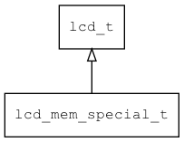

## lcd\_mem\_special\_t
### 概述


特殊的LCD。

通过重载flush函数来提交GUI绘制的结果到硬件。适用于：

* lcd 硬件不支持framebuffer，如SPI接口的屏。
* lcd 硬件支持framebuffer，但是其格式特殊，AWTK目前不支持。可以用flush进行格式转换。
----------------------------------
### 函数
<p id="lcd_mem_special_t_methods">

| 函数名称 | 说明 | 
| -------- | ------------ | 
| <a href="#lcd_mem_special_t_lcd_mem_deinit">lcd\_mem\_deinit</a> | 清除 lcd_mem 对象中的数据 |
| <a href="#lcd_mem_special_t_lcd_mem_get_next_fb">lcd\_mem\_get\_next\_fb</a> | 获取 lcd_mem 对象中的 next_fb |
| <a href="#lcd_mem_special_t_lcd_mem_get_offline_fb">lcd\_mem\_get\_offline\_fb</a> | 获取 lcd_mem 对象中的 offline_fb |
| <a href="#lcd_mem_special_t_lcd_mem_get_online_fb">lcd\_mem\_get\_online\_fb</a> | 获取 lcd_mem 对象中的 online_fb |
| <a href="#lcd_mem_special_t_lcd_mem_set_next_fb">lcd\_mem\_set\_next\_fb</a> | 设置 lcd_mem 对象中的 next_fb |
| <a href="#lcd_mem_special_t_lcd_mem_set_offline_fb">lcd\_mem\_set\_offline\_fb</a> | 设置 lcd_mem 对象中的 offline_fb |
| <a href="#lcd_mem_special_t_lcd_mem_set_online_fb">lcd\_mem\_set\_online\_fb</a> | 设置 lcd_mem 对象中的 online_fb |
| <a href="#lcd_mem_special_t_lcd_mem_special_create">lcd\_mem\_special\_create</a> | 创建lcd对象。 |
| <a href="#lcd_mem_special_t_lcd_resize">lcd\_resize</a> | 设置等待VBI事件到来的回调函数。 |
#### lcd\_mem\_deinit 函数
-----------------------

* 函数功能：

> <p id="lcd_mem_special_t_lcd_mem_deinit">清除 lcd_mem 对象中的数据

* 函数原型：

```
ret_t lcd_mem_deinit (lcd_mem_t* mem);
```

* 参数说明：

| 参数 | 类型 | 说明 |
| -------- | ----- | --------- |
| 返回值 | ret\_t | 返回RET\_OK表示成功，否则表示失败。 |
| mem | lcd\_mem\_t* | lcd\_mem 对象。 |
#### lcd\_mem\_get\_next\_fb 函数
-----------------------

* 函数功能：

> <p id="lcd_mem_special_t_lcd_mem_get_next_fb">获取 lcd_mem 对象中的 next_fb

* 函数原型：

```
uint8_t* lcd_mem_get_next_fb (lcd_mem_t* mem);
```

* 参数说明：

| 参数 | 类型 | 说明 |
| -------- | ----- | --------- |
| 返回值 | uint8\_t* | 返回 next\_fb 地址。 |
| mem | lcd\_mem\_t* | lcd\_mem 对象。 |
#### lcd\_mem\_get\_offline\_fb 函数
-----------------------

* 函数功能：

> <p id="lcd_mem_special_t_lcd_mem_get_offline_fb">获取 lcd_mem 对象中的 offline_fb

* 函数原型：

```
uint8_t* lcd_mem_get_offline_fb (lcd_mem_t* mem);
```

* 参数说明：

| 参数 | 类型 | 说明 |
| -------- | ----- | --------- |
| 返回值 | uint8\_t* | 返回 offline\_fb 地址。 |
| mem | lcd\_mem\_t* | lcd\_mem 对象。 |
#### lcd\_mem\_get\_online\_fb 函数
-----------------------

* 函数功能：

> <p id="lcd_mem_special_t_lcd_mem_get_online_fb">获取 lcd_mem 对象中的 online_fb

* 函数原型：

```
uint8_t* lcd_mem_get_online_fb (lcd_mem_t* mem);
```

* 参数说明：

| 参数 | 类型 | 说明 |
| -------- | ----- | --------- |
| 返回值 | uint8\_t* | 返回 online\_fb 地址。 |
| mem | lcd\_mem\_t* | lcd\_mem 对象。 |
#### lcd\_mem\_set\_next\_fb 函数
-----------------------

* 函数功能：

> <p id="lcd_mem_special_t_lcd_mem_set_next_fb">设置 lcd_mem 对象中的 next_fb

* 函数原型：

```
ret_t lcd_mem_set_next_fb (lcd_mem_t* mem, uint8_t* next_fb);
```

* 参数说明：

| 参数 | 类型 | 说明 |
| -------- | ----- | --------- |
| 返回值 | ret\_t | 返回RET\_OK表示成功，否则表示失败。 |
| mem | lcd\_mem\_t* | lcd\_mem 对象。 |
| next\_fb | uint8\_t* | next\_fb 地址。 |
#### lcd\_mem\_set\_offline\_fb 函数
-----------------------

* 函数功能：

> <p id="lcd_mem_special_t_lcd_mem_set_offline_fb">设置 lcd_mem 对象中的 offline_fb

* 函数原型：

```
ret_t lcd_mem_set_offline_fb (lcd_mem_t* mem, uint8_t* offline_fb);
```

* 参数说明：

| 参数 | 类型 | 说明 |
| -------- | ----- | --------- |
| 返回值 | ret\_t | 返回RET\_OK表示成功，否则表示失败。 |
| mem | lcd\_mem\_t* | lcd\_mem 对象。 |
| offline\_fb | uint8\_t* | offline\_fb 地址。 |
#### lcd\_mem\_set\_online\_fb 函数
-----------------------

* 函数功能：

> <p id="lcd_mem_special_t_lcd_mem_set_online_fb">设置 lcd_mem 对象中的 online_fb

* 函数原型：

```
ret_t lcd_mem_set_online_fb (lcd_mem_t* mem, uint8_t* online_fb);
```

* 参数说明：

| 参数 | 类型 | 说明 |
| -------- | ----- | --------- |
| 返回值 | ret\_t | 返回RET\_OK表示成功，否则表示失败。 |
| mem | lcd\_mem\_t* | lcd\_mem 对象。 |
| online\_fb | uint8\_t* | online\_fb 地址。 |
#### lcd\_mem\_special\_create 函数
-----------------------

* 函数功能：

> <p id="lcd_mem_special_t_lcd_mem_special_create">创建lcd对象。

* 函数原型：

```
lcd_t* lcd_mem_special_create (wh_t w, wh_t h, bitmap_format_t format, lcd_flush_t flush, lcd_resize_t on_resize, lcd_destroy_t on_destroy, void* ctx);
```

* 参数说明：

| 参数 | 类型 | 说明 |
| -------- | ----- | --------- |
| 返回值 | lcd\_t* | 返回lcd对象。 |
| w | wh\_t | 宽度。 |
| h | wh\_t | 高度。 |
| format | bitmap\_format\_t | 离线lcd的格式。一般用 BITMAP\_FMT\_BGR565 或 BITMAP\_FMT\_RGBA8888。 |
| flush | lcd\_flush\_t | 回调函数，用于刷新GUI数据到实际的LCD。 |
| on\_resize | lcd\_resize\_t | 用于调整LCD的大小。一般用NULL即可。 |
| on\_destroy | lcd\_destroy\_t | lcd销毁时的回调函数。 |
| ctx | void* | 回调函数的上下文。 |
#### lcd\_resize 函数
-----------------------

* 函数功能：

> <p id="lcd_mem_special_t_lcd_resize">设置等待VBI事件到来的回调函数。
> VBI: vertical blank interrupt。用于2fb等待当前显示完成，以便把下一帧的数据从offline fb拷贝到online fb，从而避免因为同时访问online fb数据造成闪烁。

* 函数原型：

```
ret_t lcd_resize (lcd_t* lcd, lcd_mem_wait_vbi_t wait_vbi, void* ctx);
```

* 参数说明：

| 参数 | 类型 | 说明 |
| -------- | ----- | --------- |
| 返回值 | ret\_t | 返回RET\_OK表示成功，否则表示失败。 |
| lcd | lcd\_t* | lcd对象。 |
| wait\_vbi | lcd\_mem\_wait\_vbi\_t | 回调函数。 |
| ctx | void* | 回调函数的上下文。 |
