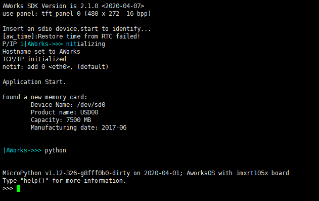
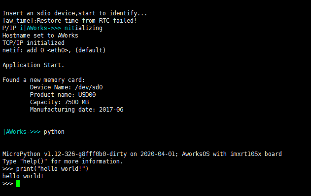
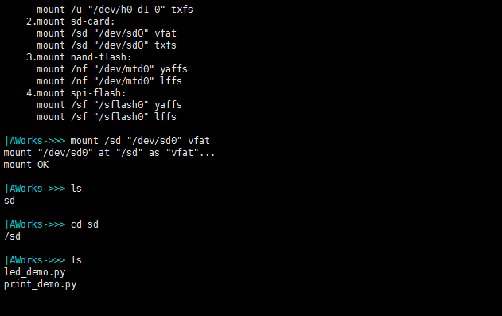
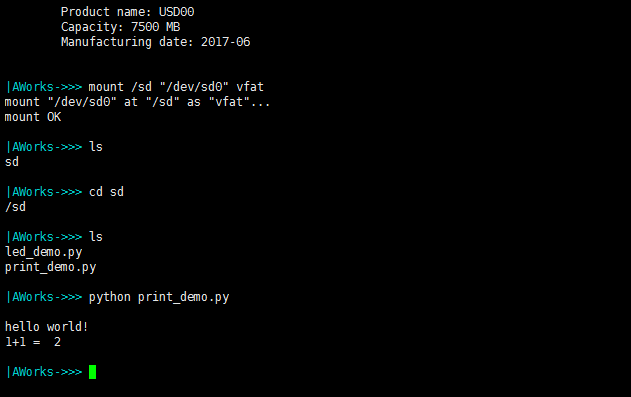
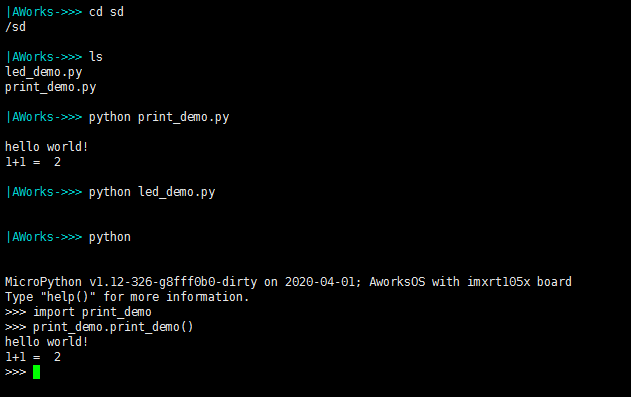

.. _entry_repl_:
进入交互命令行REPL
======================

AWorks-MicropPython通过串口提供Micropython交互式解释器（REPL），AWorks系统启动后进入Shell交互式命令行，系统在命令行注册了 ``python`` 命令，在Shell界面键入 ``python`` 命令进入MicroPython交互式解释器，如 :numref:`a_picture1` 所示。

.. _a_picture1:

   输入python命令进入REPL

在 REPL 交互命令行输入 python 代码，按下回车执行。如 :numref:`a_picture2` 所示，在REPL输入 ``print("hello world!")`` ，回车解析 python 代码，更多代码，用户可自行尝试，语法同 ``python 3`` 。

.. _a_picture2:

   执行python代码

micropython交互界面快捷键功能：

*  **CTRL + D** ：软件复位。

*  **CTRL + C** ：结束一个正在运行的python程序。

*  **CTRL + E** : micropython 的特别粘贴模式，在命令行提示符状态下，按下组合键，就会出现提示：**paste mode; Ctrl-C to cancel, Ctrl-D to finish**, 然后再粘贴代码，粘贴完成后按下 **Ctlr + D** 完成本次粘贴，按下 **CTRL + C** 取消本次粘贴。

更多快捷方式请参考 :ref:`MicroPython交互式解释器(又称REPL) <repl>` 。

运行 python 脚本
======================

此方法是在AWorks的Shell界面，通过 ``python`` 命令解析一个 ``.py`` 脚本，类似于 ``Windows cmd`` 中运行一个 ``.py`` 文件。

.. _aworks_fs:
不同于电脑系统，AWorks系统首先需要硬件平台插入“U盘/sd卡（存储.py文件）”等存储设备支持，并在Shell系统通过 ``mount /sd "/dev/sd0" vfat`` 命令挂载sd卡到AWorks文件系统下。

挂载成功后，在 AWorks 的 shell 命令行输入 ``ls`` 命令，可以看到跟目录下已经存在 **"/sd"** 目录，用 ``cd`` 命令切换目录到 **"/sd"** 目录下，切换后输入 ``ls`` 查看 当前目录下的文件，如 :numref:`a_picture3` 所示，可以看到目录下的 led_demo.py 和 print_demo.py 两个python脚本。

.. _a_picture3:

   查看 U 盘目录下文件

输入 ``python print_demo.py`` 并回车，运行 print_demo 脚本文件，输出结果如 :numref:`a_picture5` 所示。

.. _a_picture5:

   执行print_demo.py脚本

print_demo.py文件内容见 :numref:`print_demo_code` 。

 .. code-block:: py
    :caption: print_demo.py文件内容
    :name: print_demo_code
    :linenos:

    def print_demo():
        print("hello world!")
        print("1+1 = ",1+1)

    if __name__ == '__main__':
        print_demo()

输入 ``python led_demo.py`` 并回车，运行 led_demo 脚本文件，在开发板上将看到 LED0 点亮，500ms 之后熄灭。

led_demo.py文件内容见 :numref:`led_demo_code` 。

 .. code-block:: py
    :caption: led_demo.py文件内容
    :name: led_demo_code
    :linenos:

    import machine,utime
    def led_demo():
        machine.LED(0).on()
        utime.sleep_ms(500)
        machine.LED(0).off()

    if __name__ == '__main__':
        led_demo()

导入外部模块并运行
======================

导入外部模块并运行，即通过 import 文件名的方式来运行一个脚本，该方法同样需要文件系统的支持（参见 :ref:`运行 python 脚本 <aworks_fs>` ）。在 Shell 界面切换到“/u”目录，输入 ``python`` 进入 microPython 的交互命令行，在交互命令行输入 import print_demo，导入print_demo文件模块，print_demo.py文件内容见  :numref:`print_demo_code`  ，输入 print_demo.print_demo() ，并回车，运行print_demo.py中的函数，如 :numref:`a_picture6` 所示。

.. _a_picture6:

   import print_demo并运行

更多内容请参考 :ref:`MicroPython .mpy 文件 <mpy_files>` 。

aw_python_file()接口
======================

**aw_python_file()** 接口可以直接传入一个 python 脚本执行。AWorks 平台提供的 **aw_python_file()** 接口，使用户可以不需要进入REPL交互命令行，自动化的运行python文件。**aw_python_file()** 函数定义如 :numref:`aw_python_file` 。filename 是 python 文件存放的路径，以 U 盘文件系统为例,路径为 **“/u/print_demo.py”** 。

 .. code-block:: c
    :caption: aw_python_file定义
    :name: aw_python_file
    :linenos:

     void aw_python_file(const char *filename){
        mpy_main(filename);
     }

用户可在 aw_main() 中调用 **aw_python_file()** 接口，示例代码如 :numref:`aw_pyexec_file_main` 。

 .. code-block:: c
    :caption: aw_pyexec_file_main定义
    :name: aw_pyexec_file_main
    :linenos:

     demo_udisk_fs_entry();/*挂载u盘文件系统*/
     aw_python_file("/u/print_demo.py");/*执行u盘目录下的print_demo.py文件*/
     aw_python_file("/u/led_demo.py");/*执行u盘目录下的led_demo.py文件*/  