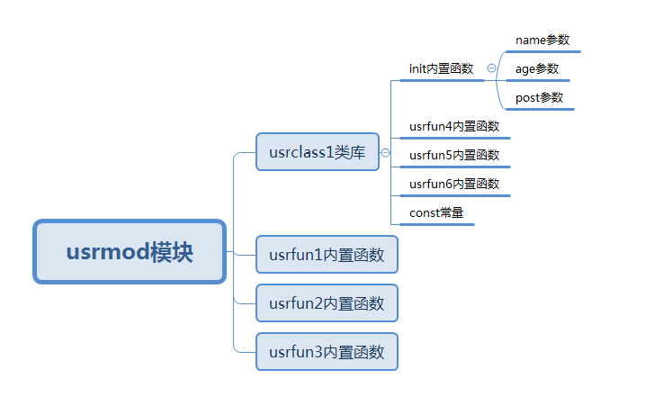
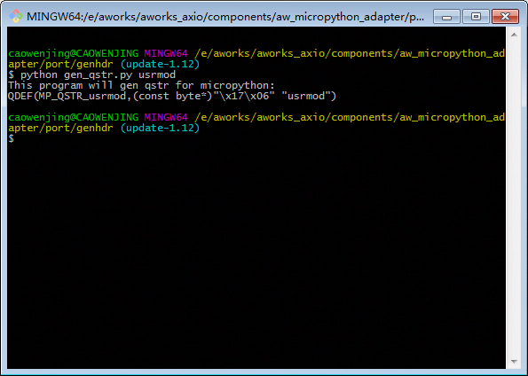

添加自定义模块
==========================================================

开发人员和用户可以根据需要在 Miropython 中自定义新的模块，添加新的类库函数，本文将以自定义模块 usrmod  为例,介绍添加一个自定义模块的方法。

本文定义的 **usrmod** 模块包含 3 个内置函数和一个类库 **usrclass1** , **usrclass1** 类库包含1个初始化函数、3个函数方法和一个常量。usrmod 模块的关系如  :numref:`a_picture_usrmod` 。usrmod模块基本包含了移植过程中常用的micropython函数接口，更多micropython的接口函数，用户可以查看 **micropython/py/obj.h** 文件。

.. _a_picture_usrmod:

   usrmod模块关系图

添加字符串的哈希值
------------------

micropython并不能直接识别用户输入的字符信息，每个字符信息都对应唯一的哈希值，micropython将通过哈希值来索引用户输入的内容。如 :numref:`a_picture_usrmod` 所示，需要获取 ``usrmod`` 、``usrclass1`` 、 ``usrfun1`` 、 ``usrfun2`` 、``usrfun3`` 、``init`` 、``usrfun4`` 、 ``usrfun5`` 、 ``usrfun6`` 、 ``const`` 、 ``name`` 、 ``age`` 和 ``post`` 13个字符串的哈希值。

.. _query_hash:

获取字符串的哈希值
++++++++++++++++++++

用户需要运行 **aw_micropython_adapter/port/genhdr** 文件夹下的gen_qstr.py文件来获取字符串的哈希值。打开 **cmd** 或 **git bash**，首先切换到正确的路径（**aw_micropython_adapter/port/genhdr**），然后运行 gen_qstr.py 脚本，并输入参数（要转化的字符串），如 :numref:`a_picture_hash` 所示； 脚本输出 ``usrmod`` 字符串的哈希值。

.. _a_picture_hash:

   获取字符串哈希值

重复以上步骤获取其他字符串的哈希值。

添加字符串的哈希值
+++++++++++++++++++++

打开 **aw_micropython_adapter/port** 文件夹下的 **qstrdefsport.h** 文件，将 :numref:`{number} <query_hash>` 中脚本的输出信息添加到文件末尾，如 :numref:`qstr_code` 所示。

 .. code-block:: c
    :caption: qstrdefs.generated.h文件内容
    :name: qstr_code
    :linenos:

    QDEF(MP_QSTR_usrmod,(const byte*)"\x17\x06" "usrmod")
    QDEF(MP_QSTR_usrclass1,(const byte*)"\x8e\x09" "usrclass1")
    QDEF(MP_QSTR_usrclass2,(const byte*)"\x8d\x09" "usrclass2")
    QDEF(MP_QSTR_usrfun1,(const byte*)"\x3d\x07" "usrfun1")
    QDEF(MP_QSTR_usrfun2,(const byte*)"\x3e\x07" "usrfun2")
    QDEF(MP_QSTR_usrfun3,(const byte*)"\x3f\x07" "usrfun3")
    QDEF(MP_QSTR_usrfun4,(const byte*)"\x38\x07" "usrfun4")
    QDEF(MP_QSTR_usrfun5,(const byte*)"\x39\x07" "usrfun5")
    QDEF(MP_QSTR_usrfun6,(const byte*)"\x3a\x07" "usrfun6")
    QDEF(MP_QSTR_age,(const byte*)"\xe6\x03" "age")
    QDEF(MP_QSTR_post,(const byte*)"\x3d\x04" "post")
    QDEF(MP_QSTR_name, (const byte*)"\xa2\x04" "name")
    QDEF(MP_QSTR_const, (const byte*)"\xc0\x05" "const")

添加 **usrmod** 模块
-----------------------

在usr_mod文件夹下建立usrmod.h、usrmod.c、usrclass1.h 和 usrclass1.c文件，打开usrmod.c，定义usrmod模块。

第一步，定义 **mp_obj_module_t** 模块类型的实例 **mp_module_usrmod**，如 :numref:`module_code` 所示。用户在自定义模块时所需更改的只是 ``usrmod`` 字符串的名字，其他无需更改。

 .. code-block:: c
    :caption: mp_module_usrmod实例
    :name: module_code
    :linenos:
    
    /*
     * \brief usrmod模块实例
     */
    const mp_obj_module_t mp_module_usrmod = {
        .base = { &mp_type_module },
        .globals = (mp_obj_dict_t*)&mp_module_usrmod_globals,
    };

第二步，定义 :numref:`module_code` 中的字典类型的实例对象 **mp_module_usrmod_globals**，**mp_module_usrmod_globals** 是usrmod模块内置函数、类表，如 :numref:`mp_module_usrmod_globals` 所示。

 .. code-block:: c
    :caption: mp_module_usrmod_globals实例
    :name: mp_module_usrmod_globals
    :linenos:

    /*
     * \brief usrmod模块内置函数、类表
     */
    STATIC const mp_rom_map_elem_t mp_module_usrmod_globals_table[] = {
        { MP_ROM_QSTR(MP_QSTR___name__), MP_ROM_QSTR(MP_QSTR_usrmod) },

        //usrmod模块的内置函数
        { MP_ROM_QSTR(MP_QSTR_usrfun1), MP_ROM_PTR(&usrmod_usrfun1_obj) },
        { MP_ROM_QSTR(MP_QSTR_usrfun2), MP_ROM_PTR(&usrmod_usrfun2_obj) },
        { MP_ROM_QSTR(MP_QSTR_usrfun3), MP_ROM_PTR(&usrmod_usrfun3_obj) },

        //usrmod模块下的类库
        { MP_ROM_QSTR(MP_QSTR_usrclass1), MP_ROM_PTR(&usrmod_usrclass1_type) },
    };

    STATIC MP_DEFINE_CONST_DICT(mp_module_usrmod_globals, mp_module_usrmod_globals_table);    

其中 **usrmod_usrfun1_obj** 、 **usrmod_usrfun2_obj** 和 **usrmod_usrfun3_obj** 是内置函数类型的实例对象，**usrmod_usrclass1_type** 是一个 class 类型实例对象。

第三步，定义 **usrmod_usrfun1_obj** 实例对象，如 :numref:`usrmod_usrfun1_obj` 。

 .. code-block:: c
    :caption: usrmod_usrfun1_obj实例
    :name: usrmod_usrfun1_obj
    :linenos:

    /*
    * \brief
    * \param 无
    * 
    */
    STATIC mp_obj_t usrmod_usrfun1(void) {

        /*函数功能用户可自行添加*/

        printf("-----------------------------------------\r\n");
        printf("wait add function...\r\n");
        printf("-----------------------------------------\r\n");

        return mp_const_none;
    }
    STATIC MP_DEFINE_CONST_FUN_OBJ_0(usrmod_usrfun1_obj,usrmod_usrfun1);

这一步其实主要是定义 **usrmod_usrfun1()** 函数，然后调用 MP_DEFINE_CONST_FUN_OBJ_0 宏把 **usrmod_usrfun1()** 函数赋值给内置函数类型的实例对象 **usrmod_usrfun1_obj** ，MP_DEFINE_CONST_FUN_OBJ_0 表示 usrfun1() 函数无参数，用户可根据函数参数的个数选择不同的 MP_DEFINE_CONST_FUN_OBJ_* 宏，其他宏的使用将在下文讲到。

usrfun1 函数使用方法如 :numref:`usrfun1_code` 。

 .. code-block:: py
    :caption: usrmod.usrfun1 使用方法
    :name: usrfun1_code
    :linenos:
    
    from usrmod import *

    usrfun1()

第四步，定义 **usrmod_usrfun2_obj** 实例对象，如 :numref:`usrmod_usrfun2_obj` 。

 .. code-block:: c
    :caption: usrmod_usrfun2_obj实例
    :name: usrmod_usrfun2_obj
    :linenos:

    /*
     * \brief
     * \param[in] arg int类型参数
     *
     */
    STATIC mp_obj_t usrmod_usrfun2(mp_obj_t arg) {

        /*参数类型判断，获取int型的参数数据*/
        if(!MP_OBJ_IS_INT(arg)){
            nlr_raise(mp_obj_new_exception_msg_varg(&mp_type_ValueError, "arg must be int"));
        }

        /*将 mp_obj_t 类型转换成 int 型*/
        int data = mp_obj_get_int(arg);
        printf("data = %d\r\n",data);

        printf("-----------------------------------------\r\n");
        printf("wait add function...\r\n");
        printf("-----------------------------------------\r\n");

        return mp_const_none;
    }
    STATIC MP_DEFINE_CONST_FUN_OBJ_1(usrmod_usrfun2_obj, usrmod_usrfun2);

MP_DEFINE_CONST_FUN_OBJ_1 宏表示 usrmod_usrfun2() 函数有1个参数，在usrfun2中可以调用micropython的接口函数进行参数类型的判断、转换等操作，获取用户需要的参数类型。本文中定义的 usrmod_usrfun2() 函数参数必须为整型，具体实现方法可参考程序  :numref:`usrmod_usrfun2_obj` 。 

usrfun2 函数使用方法如 :numref:`usrfun2_code` 。

 .. code-block:: py
    :caption: usrmod.usrfun2 使用方法
    :name: usrfun2_code
    :linenos:

    from usrmod import *

    usrfun2(1)

第五步，定义 **usrmod_usrfun3_obj** 实例对象，如 :numref:`usrmod_usrfun3_obj` 。

 .. code-block:: c
    :caption: usrmod_usrfun3_obj实例
    :name: usrmod_usrfun3_obj
    :linenos:

     /*
     * \brief
     * \param[in] arg1 tuple类型参数
     * \param[in] arg2 tuple类型参数
     * 
     * usrmod.usrfun3(tuple1 = (string,int),tuple2 = (string,int))
     */
    STATIC mp_obj_t usrmod_usrfun3(mp_obj_t arg1,mp_obj_t arg2) {

        /*参数类型判断*，两个参数必须是元祖类型*/
        if (!MP_OBJ_IS_TYPE(arg1, &mp_type_tuple) || !MP_OBJ_IS_TYPE(arg2, &mp_type_bytearray)) {
            nlr_raise(mp_obj_new_exception_msg_varg(&mp_type_ValueError, "arg must be tuple"));
        }

        /*元祖类型转换*/
        mp_obj_t *items1;
        mp_obj_get_array_fixed_n(arg1, 2, &items1);
        const char *buf1 = mp_obj_str_get_str(items1[0]);
        int id1 = mp_obj_get_int(items1[1]);

        mp_obj_t *items2;
        mp_obj_get_array_fixed_n(arg1, 2, &items2);
        const char *buf2 = mp_obj_str_get_str(items2[0]);
        int id2 = mp_obj_get_int(items2[1]);

        printf("tuple1 = (%s,%d\r\n",buf1,id1);
        printf("tuple2 = (%s,%d)\r\n",buf2,id2);

        printf("-----------------------------------------\r\n");
        printf("wait add function...\r\n");
        printf("-----------------------------------------\r\n");

        return mp_const_none;
    }
    STATIC MP_DEFINE_CONST_FUN_OBJ_2(usrmod_usrfun3_obj,usrmod_usrfun3);

MP_DEFINE_CONST_FUN_OBJ_2 宏表示 usrmod_usrfun3() 函数有2个参数，在 usrmod_usrfun3() 中可以调用 micropython 的接口函数进行参数类型的判断、转换等操作，获取用户需要的参数类型。本文中定义的 usrmod_usrfun3() 函数参数必须为元祖类型，具体实现方法可参考程序  :numref:`usrmod_usrfun3_obj` 。 

usrfun3 函数使用方法如 :numref:`usrfun3_code` 。

 .. code-block:: py
    :caption: usrmod.usrfun3 使用方法
    :name: usrfun3_code
    :linenos:

    from usrmod import *

    t1 = ('a',1)
    t2 = ('b',2)

    usrfun2(t1,t2)

第六步，打开usrclass1.c，定义“mp_obj_type_t”类型的 **usrmod_usrclass1_type** 实例对象，并且初始化，如 :numref:`usrmod_usrclass1_type` 所示。

 .. code-block:: c
    :caption: usrmod_usrclass1_type实例
    :name: usrmod_usrclass1_type
    :linenos:
    
    /*
     * \brief usrclass1类型对象的基类对象
     */
    const mp_obj_type_t usrmod_usrclass1_type = {
        { &mp_type_type },
        .name = MP_QSTR_usrclass1,
        .print = usrmod_usrclass1_print,
        .make_new = mp_usrmod_usrclass1_make_new,
        .locals_dict = (mp_obj_t)&usrmod_usrclass1_locals_dict,
    };

usrmod_usrclass1_type实例包含了usrclass1类的构造函数，和其他的函数方法，其中 **mp_usrmod_usrclass1_make_new** 为构造函数， **usrmod_usrclass1_print** 为打印输出函数，**usrmod_usrclass1_locals_dict** 是一个字典对象，里面包含对象的一些函数方法。

第七步，定义 **usrclass1_obj_t** 类型结构体，**usrclass1_obj_t** 结构体定义了一个基类base 和 usrclass1 类的一些特定的属性，这些特定属性用户可根据需求自行定义，如 :numref:`usrclass1_obj_t` 所示。当使用“usrclass1”创建对象时，将调用 :numref:`usrmod_usrclass1_type` 中实例对象usrmod_usrclass1_type的.make_new构造函数，在该函数中，会创造一个usrclass1_obj_t类型的对象，该对象的base 变量将继承 **usrmod_usrclass1_type** 实例，其他属性需用户自定义。

 .. code-block:: c
    :caption: usrclass1_obj_t实例
    :name: usrclass1_obj_t
    :linenos:

    /*
     * \brief usrclass1类
     */
    typedef struct _usrclass1_obj_t {
        mp_obj_base_t base;
        mp_uint_t id;
        char name[16];
        mp_uint_t age;
        char post[16];
    } usrclass1_obj_t;

第八步，定义 **mp_usrmod_usrclass1_make_new** 构造函数，当使用“usrclass1”类创建对象时，将自动调用该构造函数，该函数会为 usrclass1_obj_t 类型的对象分配空间，创建对象时需要传入对象的 id 号，其他的初始化信息可自行选择是否传入。函数定义如 :numref:`mp_usrmod_usrclass1_make_new` 。

 .. code-block:: c
    :caption: mp_usrmod_usrclass1_make_new 函数
    :name: mp_usrmod_usrclass1_make_new
    :linenos:
    
    /* \brief 创建usrclass1_obj_t类型对象，并初始化id
     *
     * \param type usrmod_usrclass1_type基类对象
     * \param n_args 普通参数个数
     * \param n_kw 带关键字参数个数
     * \param args 参数起始地址
     *
     * \return usrclass1类型对象
     */
    STATIC mp_obj_t mp_usrmod_usrclass1_make_new(const mp_obj_type_t *type, uint n_args, uint n_kw, const mp_obj_t *args) {
        // check arguments
        mp_arg_check_num(n_args, n_kw, 1, MP_OBJ_FUN_ARGS_MAX, AW_PSP_TRUE);

        usrclass1_obj_t *self = m_new_obj(usrclass1_obj_t);

        //内存不足
        if (!self) {
            mp_raise_OSError(ENOMEM);
        }

        //self对象继承 **usrmod_usrclass1_type** 实例
        self->base.type = &usrmod_usrclass1_type;

        //将args[0]转换成整型
        self->id = mp_obj_get_int(args[0]);

        //初始化信息
        if (n_args > 1 || n_kw > 0) {
            mp_map_t kw_args;
            mp_map_init_fixed_table(&kw_args, n_kw, args + n_args);
            usrmod_usrclass1_obj_init_helper(self, n_args - 1, args + 1, &kw_args);
        }

        return (mp_obj_t) self;
    }

在 :numref:`mp_usrmod_usrclass1_make_new` 中 **usrmod_usrclass1_obj_init_helper()** 函数定义如 :numref:`usrmod_usrclass1_obj_init_helper` ，主要进行对象的初始化操作。该函数主要是对对象的各个参数赋值，关键在于参数的合法性判断，以及参数类型转换操作。

 .. code-block:: c
    :caption: usrmod_usrclass1_obj_init_helper函数
    :name: usrmod_usrclass1_obj_init_helper
    :linenos:
    
    /*
     * \brief usrclass1对象初始化
     *
     * \param[in] self 对象实例
     * \param[in] n_args 普通参数个数，name参数是必选项，age参数是int型,默认值是30，为可选项
     * \param[in] pos_args 普通参数起始位置
     * \param[in] kw_args 带关键字参数，post参数是带关键字的参数，为可选项
     *
     * \retun NULL
     *
     */    
    STATIC mp_obj_t usrmod_usrclass1_obj_init_helper (usrclass1_obj_t *self, size_t n_args, const mp_obj_t *pos_args, mp_map_t *kw_args) {
        enum {ARG_name, ARG_age, ARG_post };
        static const mp_arg_t allowed_args[] = {
            { MP_QSTR_name, MP_ARG_REQUIRED | MP_ARG_OBJ },
            { MP_QSTR_age, MP_ARG_INT, {.u_int = 30}},
            { MP_QSTR_post, MP_ARG_KW_ONLY | MP_ARG_OBJ, {.u_obj = MP_OBJ_NULL}},
        };

        // parse args
        mp_arg_val_t args[MP_ARRAY_SIZE(allowed_args)];
        mp_arg_parse_all(n_args, pos_args, kw_args, MP_ARRAY_SIZE(allowed_args), allowed_args, args);

        const char *name = mp_obj_str_get_str(args[ARG_name].u_obj);
        strncpy(self->name, name, sizeof(name));

        self->age = args[ARG_age].u_int;
        // check age
        if (self->age < 0 || self->age >100) {
            nlr_raise(mp_obj_new_exception_msg_varg(&mp_type_ValueError, "age in range 0~100"));
        }

        if(args[ARG_post].u_obj != MP_OBJ_NULL){
            const char *post = mp_obj_str_get_str(args[ARG_post].u_obj);
            strncpy(self->post, post, sizeof(post));
        }

        return mp_const_none;
    }

在 :numref:`usrmod_usrclass1_obj_init_helper` 中 name 参数在初始化时必须传入，age 和 post 参数不是必须的，其中 post 参数在使用时必须指定关键词 post ,其他参数是否指定关键词是可选项，使用方法如 :numref:`int_code` 。

 .. code-block:: py
    :caption: 构造对象方法
    :name: int_code
    :linenos:

    from usrmod import usrclass1

    usr1 = usrclass1(1)

    usr2 = usrclass(2,'lisi',33,post = 'test')

    usr3 = usrclass(3,'wangwu',33)

第九步，定义 **usrmod_usrclass1_print** 函数， **usrmod_usrclass1_print** 函数将在调用某个对象变量时，打印出某个具体对象的属性信息。函数实现如 :numref:`usrmod_usrclass1_print` 。

 .. code-block:: c
    :caption: usrmod_usrclass1_print函数
    :name: usrmod_usrclass1_print
    :linenos:
    
    /*
     * \brief 打印usrclass1类型对象属性信息
     *
     * \param self_in 对象实例
     *
     */
    void usrmod_usrclass1_print(const mp_print_t *print, mp_obj_t self_in, mp_print_kind_t kind) {
        usrclass1_obj_t *self = self_in;
         mp_printf(print, "<usrclass1 %d>", self->id);
    }

第十步，定义 **usrmod_usrclass1_locals_dict** 字典类型实例，该实例包含了usrclass1类的函数方法表，方法类似于第二步，如 :numref:`usrmod_usrclass1_locals_dict_table` 所示。

 .. code-block:: c
    :caption: usrmod_usrclass1_locals_dict_table实例
    :name: usrmod_usrclass1_locals_dict_table
    :linenos:

    /*
     * brief usrclass1类内置函数表
     */
     STATIC const mp_rom_map_elem_t usrmod_usrclass1_locals_dict_table[] = {
        // instance methods

        //初始化函数
        { MP_ROM_QSTR(MP_QSTR_init),    MP_ROM_PTR(&usrmod_usrclass1_obj_init_obj) },

        //方法
        { MP_ROM_QSTR(MP_QSTR_usrfun4),    MP_ROM_PTR(&usrmod_usrclass1_obj_usrfun4_obj) },
        { MP_ROM_QSTR(MP_QSTR_usrfun5),    MP_ROM_PTR(&usrmod_usrclass1_obj_usrfun5_obj) },
        { MP_ROM_QSTR(MP_QSTR_usrfun6),    MP_ROM_PTR(&usrmod_usrclass1_obj_usrfun6_obj) },

        //常量
        { MP_ROM_QSTR(MP_QSTR_const),    MP_ROM_INT(USRCLASS_CONST_AGE) },
    };
    STATIC MP_DEFINE_CONST_DICT(usrmod_usrclass1_locals_dict, usrmod_usrclass1_locals_dict_table);

其中 **usrmod_usrclass1_obj_init_obj** 、 **usrmod_usrclass1_obj_usrfun4_obj** 、**usrmod_usrclass1_obj_usrfun5_obj** 和 **usrmod_usrclass1_obj_usrfun6_obj** 都是内置函数类型的实例，USRCLASS_CONST_AGE 是一个常量。类的函数方法和模块的函数方法在参数上有一点区别，当调用类的内置函数时，会自动传入对象的地址作为参数列表中的第一个参数。

第十一步，定义 **usrmod_usrclass1_obj_init_obj** 实例， 如 :numref:`usrmod_usrclass1_obj_init_obj` 所示。

 .. code-block:: c
    :caption: usrmod_usrclass1_obj_init_obj实例
    :name: usrmod_usrclass1_obj_init_obj
    :linenos:

    /*
     * \brief usrclass1对象初始化
     *
     * \param n_args 参数个数，name参数是必选项，age参数是int型,默认值是30，为可选项
     * \param args 参数起始地址，args[0]为对象实例
     * \param kw_args 带关键字参数，post参数是带关键字的参数，为可选项
     */
    STATIC mp_obj_t usrmod_usrclass1_obj_init(size_t n_args, const mp_obj_t *args, mp_map_t *kw_args) {
        return usrmod_usrclass1_obj_init_helper(args[0], n_args - 1, args + 1, kw_args);
    }
    STATIC MP_DEFINE_CONST_FUN_OBJ_KW(usrmod_usrclass1_obj_init_obj, 1, usrmod_usrclass1_obj_init);

这一步其实主要是定义 **usrmod_usrclass1_obj_init()** 初始化函数，**usrmod_usrclass1_obj_init()** 函数调用 :numref:`usrmod_usrclass1_obj_init_helper` 所述的 **usrmod_usrclass1_obj_init_helper()** 函数接口进行初始化。MP_DEFINE_CONST_FUN_OBJ_KW 宏函数表示 **usrmod_usrclass1_obj_init()** 函数参数不固定，最小传入参数为1，且参数带有关键字。

.. attention::
  在使用python语言调用对象的内置函数时，系统会自动传入对象本身作为内置函数的第一个参数。所以用户实际可传入的参数最大个数将与定义内置函数参数个数少1.

init 函数使用方法如 :numref:`usrclass1_init` 。

 .. code-block:: py
    :caption: usrclass1.init 使用方法
    :name: usrclass1_init
    :linenos:

    from usrmod import *

    usr = usrclass1(1)
    usr.init('zhangsan',33,post = 'soft')

第十二步，定义 **usrmod_usrclass1_obj_usrfun4_obj** 实例，如 :numref:`usrmod_usrclass1_obj_usrfun4_obj` 所示。

 .. code-block:: c
    :caption: usrmod_usrclass1_obj_usrfun4_obj实例
    :name: usrmod_usrclass1_obj_usrfun4_obj
    :linenos:

    /*
     * \brief
     *
     * \param arg1 实例对象
     * \param[in] arg2 参数1，array类型
     * \param[in] arg3 参数2，array类型
     */
    STATIC mp_obj_t usrmod_usrclass1_obj_usrfun4(mp_obj_t arg1,mp_obj_t arg2,mp_obj_t arg3){

        usrclass1_obj_t *self = arg1;

        printf("self->name is %s\r\n",self->name);
        printf("self->age is %d\r\n",self->age);
        printf("self->post is %s\r\n",self->post);

        /*参数类型判断,arg2和arg3必须是 bytearray 型*/
        if (!MP_OBJ_IS_TYPE(arg2, &mp_type_bytearray) || !MP_OBJ_IS_TYPE(arg3, &mp_type_bytearray)) {
            nlr_raise(mp_obj_new_exception_msg_varg(&mp_type_ValueError, "arg must be bytearray"));
        }

        mp_obj_array_t *array1 = MP_OBJ_TO_PTR(arg2);
        mp_obj_array_t *array2 = MP_OBJ_TO_PTR(arg3);

        printf("array1 = %s\r\n",(char*)array1->items);
        printf("array2 = %s\r\n",(char*)array2->items);

        /*函数功能待添加*/

        return mp_const_none;
    }
    STATIC MP_DEFINE_CONST_FUN_OBJ_3(usrmod_usrclass1_obj_usrfun4_obj,usrmod_usrclass1_obj_usrfun4);

**usrmod_usrclass1_obj_usrfun4()** 函数有3个参数，所以使用 MP_DEFINE_CONST_FUN_OBJ_3 宏函数定义 **usrmod_usrclass1_obj_usrfun4_obj** 实例。

usrfun4 函数使用方法如 :numref:`usrfun4_code` 。

 .. code-block:: py
    :caption: usrclass1.usrfun4 使用方法
    :name: usrfun4_code
    :linenos:

    from usrmod import *

    usr = usrclass1(1)
    usr.init('zhangsan',33,post = 'soft')

    array1 = bytearray('123')
    array2 = bytearray('456')
    #参数类型bytearray，个数:2
    usr.usrfun4(array1,array2)

第十三步，定义 **usrmod_usrclass1_obj_usrfun5_obj** 实例，如 :numref:`usrmod_usrclass1_obj_usrfun5_obj` 所示。

 .. code-block:: c
    :caption: usrmod_usrclass1_obj_usrfun5_obj 实例
    :name: usrmod_usrclass1_obj_usrfun5_obj
    :linenos:

    /*
     * \brief
     *
     * \param arg1 实例对象
     * \param[in] arg2 参数1，dict类型
     * \param[in] arg3 参数2，dict类型
     */
    STATIC mp_obj_t usrmod_usrclass1_obj_usrfun5(uint n_args, const mp_obj_t *args){

        usrclass1_obj_t *self = args[0];

        printf("self->name is %s\r\n",self->name);
        printf("self->age is %d\r\n",self->age);
        printf("self->post is %s\r\n",self->post);

        if(n_args > 1){
            /*参数类型判断，args[1]必须是字典类型*/
            if (!MP_OBJ_IS_TYPE(args[1], &mp_type_dict)) {
                nlr_raise(mp_obj_new_exception_msg_varg(&mp_type_ValueError, "args[1] must be dict"));
            }

            /*字典类型转换,该例程需要定义{string:int,string:int...}类型的字典,否则转化数据会出错*/
            mp_obj_dict_t *d = MP_OBJ_TO_PTR(args[1]);
            printf("dict = {'%s':%d,'%s':%d}\r\n",
                    mp_obj_str_get_str(d->map.table[0].key),
                    mp_obj_get_int(d->map.table[0].value),
                    mp_obj_str_get_str(d->map.table[1].key),
                    mp_obj_get_int(d->map.table[1].value));
        }

        /*函数功能待添加*/

        return mp_const_none;
    }
    STATIC MP_DEFINE_CONST_FUN_OBJ_VAR(usrmod_usrclass1_obj_usrfun5_obj,1,usrmod_usrclass1_obj_usrfun5);

使用 MP_DEFINE_CONST_FUN_OBJ_VAR 宏函数，则表示 **usrmod_usrclass1_obj_usrfun5()** 函数参数不固定，本文定义的最小传入参数为1。

usrfun5 函数使用方法如 :numref:`usrfun5_code` 。

 .. code-block:: py
    :caption: usrclass1.usrfun5 使用方法
    :name: usrfun5_code
    :linenos:

    from usrmod import *

    usr = usrclass1(1)
    usr.init('zhangsan',33,post = 'soft')

    #参数个数大于等于 0 ,第一个参数必须是 {string:int,string:int...} 字典类型
    usr.usrfun5()
    usr.usrfun5({'a':1,'b':2})
    usr.usrfun5({'a':1,'b':2},2)
    usr.usrfun5({'a':1,'b':2},2,'a')

第十四步，定义 **usrmod_usrclass1_obj_usrfun6_obj** 实例，如 :numref:`usrmod_usrclass1_obj_usrfun6_obj` 所示。

 .. code-block:: c
    :caption: usrmod_usrclass1_obj_usrfun6_obj 实例
    :name: usrmod_usrclass1_obj_usrfun6_obj
    :linenos:

    /*
     * \brief
     *
     * \param arg1：实例对象
     * \param[in] arg2：参数1，list类型
     * \param[in] arg3：参数2，list类型
     *
     */
    STATIC mp_obj_t usrmod_usrclass1_obj_usrfun6(uint n_args, const mp_obj_t *args){

        usrclass1_obj_t *self = args[0];

        printf("self->name is %s\r\n",self->name);
        printf("self->age is %d\r\n",self->age);
        printf("self->post is %s\r\n",self->post);

        if(n_args > 1){
            /*参数类型判断*/
            if (!MP_OBJ_IS_TYPE(args[1], &mp_type_list)) {
                nlr_raise(mp_obj_new_exception_msg_varg(&mp_type_ValueError, "args[1] must be list"));
            }

            /*该例程需要定义[int,string,string...]类型的列表，否则参数类型转换会出错*/
            mp_obj_list_t *ret = MP_OBJ_TO_PTR(args[1]);

            printf("list = [%d,'%s','%s']\r\n",
                    mp_obj_get_int(ret->items[0]),
                    mp_obj_str_get_str(ret->items[1]),
                    mp_obj_str_get_str(ret->items[2]));
        }

        /*函数功能待添加*/

        return mp_const_none;
    }
    STATIC MP_DEFINE_CONST_FUN_OBJ_VAR_BETWEEN(usrmod_usrclass1_obj_usrfun6_obj,1,3,usrmod_usrclass1_obj_usrfun6);

本文使用的 MP_DEFINE_CONST_FUN_OBJ_VAR_BETWEEN 宏函数定义的 **usrmod_usrclass1_obj_usrfun6_obj** 实例，表示 **usrmod_usrclass1_obj_usrfun6_obj()** 函数的参数在 1 ~ 3 个之间。由于对象的内置函数第一个参数必须传入对象的地址，所以在使用python语法时，用户可传入的参数实际是0~2个。

usrfun6 函数使用方法如 :numref:`usrfun6_code` 。

 .. code-block:: py
    :caption: usrclass1.usrfun6 使用方法
    :name: usrfun6_code
    :linenos:

    from usrmod import *

    usr = usrclass1(1)
    usr.init('zhangsan',33,post = 'soft')

    #参数个数在 0 ~ 2 之间 ，第一个参数必须是 [int,string,string...] 列表类型
    usr.usrfun6()
    usr.usrfun6([1,'a','bc'])
    usr.usrfun6([1,'a','bc'],const)

最后，在 **aw_micropython_adapter/port/mpconfigport.h** 定义模块控制宏，如 :numref:`usrmod_cfg`,并在 **aw_micropython_adapter/port/mpconfigport.h** 中的模块列表中注册 **usrmod** 模块，如 :numref:`insert_usrmod` 。 

 .. code-block:: c
    :caption:  定义MICROPY_PY_USRMOD
    :name: usrmod_cfg
    :linenos:

    #define MICROPY_PY_USRMOD           (1)

 .. code-block:: c
    :caption:  定义MICROPY_USR_MOD_USRMOD
    :name: insert_usrmod
    :linenos:

    #if MICROPY_PY_USRMOD
    #define MICROPY_PORT_MOD_USRMOD   { MP_ROM_QSTR(MP_QSTR_usrmod), MP_ROM_PTR(&mp_module_usrmod) },
    #else
    #define MICROPY_PORT_MOD_USRMOD
    #endif

    /** \brief 注册适配模块 */
    #define MICROPY_PORT_BUILTIN_MODULES \
            MICROPY_PORT_MOD_MACHINE \
            MICROPY_PORT_MOD_AWORKS \
            MICROPY_PORT_MOD_UOS \
            MICROPY_PORT_MOD_USOCKET \
            MICROPY_PORT_MOD_UTIME \
            MICROPY_PORT_MOD_USRMOD

至此，新的模块内容已经添加完成。本文定义的 **usrmod** 模块包含了基本的类、内置函数等类型，内置函数参数个数的设计列举了从0到任意个参数的方法，参数类型列举了整型、bytearray、元祖和字典等常用的python数据类型，参数类型的转换也在对应的函数中列举。用户或者开发者在增加一个新模块时，可直接拷贝 usrmod 模块内容，在此基础上进行修改。