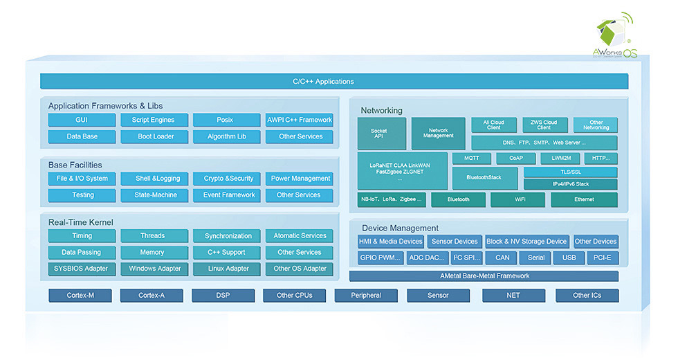

# SDK简介

## 目录说明

| 目录               | 说明                             |
| ------------------ | -------------------------------- |
| aworks_awtk_rt1052 | awtk库、源码，以及rt1052适配代码 |
| aworks_sdk         | aworks库、源代码                 |
| examples           | 应用例程                         |
| projects           | 工程目录                         |
| tools              | 烧录工具                         |

## projects工程目录

| 目录                 | 说明                                                         |
| -------------------- | ------------------------------------------------------------ |
| img_rt1050_debug     | eclipse工程，m1052开发板模板工程                             |
| img_rt1050_debug_mdk | keil工程，m1052开发板模板工程                                |
| m1052_awtk           | eclipse工程，适配了awtk GUI组件                              |
| m1052_awtk_mdk       | keil工程，适配了awtk GUI组件                                 |
| m1052_zws            | eclipse工程，适配了ZWS云平台， 文档目录``projects\m1052_zws\tools\doc`` |

- **注意:**

为了防止用户自己配置工程出错，不建议用户自己配置awtk工程和zws工程，可直接使用已经配置好的m1052_awtk、 m1052_awtk_mdk 和 m1052_zws工程，或通过拷贝的方式新建工程。

## 例程说明

| 例程类型    | 说明                                                         |
| ----------- | ------------------------------------------------------------ |
| application | 应用例程，具有具体应用场景的应用方案，如 web 服务器、 shell 应用等 |
| component   | 组件的基本使用例程，如文件系统、网络等                       |
| feature     | CPU 特殊外设例程，如浮点运算、中断响应测试等例程             |
| peripheral  | 基础外设例程，如 SPI、 I2C、 CAN、 ADC 等                    |
| system      | 系统内核例程，如任务、消息、信号量、软件定时器等             |

## 参考文档

AWorks sdk使用方法，请阅读[在线文档](https://manual.zlg.cn/web/#/23?page_id=942 )

# 平台框架

AWorksOS平台架构 AWorksOS工业智能物联开发平台是采用面向框架的设计架构，支持平台组件“可插拔、可替换、可配置”、与硬件无关、与操作系统种类无关的方式设计，用户只需修改相应的头文件，即可实现应用代码的跨平台复用。 

# 组件简介

AWorksOS提供高效、功能完善的服务组件，默认包含的组件主要有以下2类：
* 常见/常用的基础组件，文件系统、I/O系统，Shell服务、加密（安全服务）、电源管理、测试框架、状态机框架、时间管理框架等
* 外设驱动运行所需的中间件及第三方组件，如AWTK GUI、LWIP、Canopen等

AWorks SDK主要分为两个系列：标准版、专业版。标准版对应芯片级开发，只包含在某一芯片上运行基础Demo的必须组件。专业版包含的组件更为丰富，主要对应基于我司核心板的开发，包含了很多扩展组件。AWorks的组件列表如下：

- **aw_base**：AWorks基础组件
- **aw_interface**：标准API接口
- **awbus_lite**：awbus_lite总线框架
- **aw_clock**：AWorks时钟管理系统
- **aw_usb**：USB组件
- **aw_shell**：Shell组件
- **am_smf**：有限状态机框架
- **aw_amsmf_adapter**：SMF状态机框架适配器
- **aw_pthread**：线程管理
- **aw_qrcode**：二维码解码
- **rtk**：rtk内核
- **aw_psp_rtk**：rtk内核的平台适配
- **aw_net_core**：网络核心基础组件
- **aw_dhcp_server**：DHCP服务器
- **aw_ftpd**：FTP服务器
- **modbus**：AWorksModbus协议支持
- **aw_net_tools**：网络相关的工具
- **aw_netbios**：网络基本输入输出系统（OSI）
- **aw_pcap**：pcap抓包库（Wireshark/TShark）
- **aw_ping**：网络诊断工具ping
- **aw_smtp**：SMTP客户端
- **aw_telnet**：telnet协议
- **goahead-2_5_adapter**：goahead-2_5适配器
- **httpsrv_adapter**：httpsrv适配器
- **aw_lwip_14x_adapter**：LWIP1.4.x版本适配器
- **aw_lwip_21x_adapter**：LWIP2.x版本适配器
- **mbedtls-2_4_0_adapter**：mbedtls适配器
- **goahead-2_5**：嵌入式Wed服务器
- **httpsrv**：Web服务器
- **libcurl**：支持多种协议的数据传输库
- **lwip@1.4.1**：LWIP协议栈
- **lwip@2.1.2**：LWIP协议栈
- **mbedtls-2_4_0-apache**：mbedtls
- **newlib**：C标准库newlib适配器
- **AwCanFestivalAdapter**：CanFestival协议栈
- **CanFestival@3.0.0-RC3**：CANopen开源协议栈
- **CanFestival@3.8.0**：CANopen开源协议栈
- **CANopen**：AWorks Canopen协议栈
- **aw_txfs**：事务型文件系统（基于块设备）
- **aw_romfs**：只读型文件系统
- **aw_lffs**：LargeFlashFileSystem
- **aw_fatfs_adapter**：FAT文件系统适配器
- **aw_yaffs2_adapter**：yaffs文件系统适配器
- **yaffs2@1.3.6**：yaffs2文件系统
- **fatfs**：FAT文件系统
- **lora_softimer**：Lora软件定时器（低功耗）
- **lora_sx1276**：sx1276Lora芯片驱动
- **lora_utilities**：lora相关工具
- **loranet_stack**：loranet协议栈
- **aw_loranet_adapter**：loranet协议栈的适配器
- **aw_sqlite3_adapter**：sqlite3适配器
- **aw_lua53x_adapter**：lua适配器
- **aw_unity_adapter**：Unity适配器
- **aw_zlib12x_adapter**：zlib适配器
- **lua@5.3.4**：lua脚本语言支持
- **zlib@1.2.11**：zlib压缩算法
- **unity**：单元测试
- **tinyxml_2_6_2**：XML解析器（C++语言实现）
- **cjson**：JSON解析器（C语言实现）
- **sqlite3**：SQLite数据库
- **fftw**：FFT计算库（C语言实现）

# 驱动简介

SDK默认包含的驱动主要有以下4类：

1. 板级驱动支持（标准开发板上所有硬件的驱动）

2. 标准扩展板驱动（比如MiniPort接口对应的所有扩展板驱动）

3. 常见扩展器件、模块驱动（比如EEPROM等） 

4. 我司自主代理器件模块驱动（比如ZLG600、ZLG7218等）

标准SDK中包含的驱动组价列表如下：
- **board**                                 
  * **miniport_gpio_digitron**：以GPIO驱动的数码管miniport板驱动
  * **miniport_hc595_digitron**：以HC595驱动的数码管miniport板驱动
  * **miniport_hc595_led**：以HC595驱动的LED miniport板驱动
  * **miniport_key_digitron**：以GPIO驱动的数码管及矩阵按键miniport板驱动
  * **miniport_key_hc595_digitron** ：以HC595驱动的数码管及矩阵按键miniport板驱动
  * **matrix_key_lite**：基于GPIO驱动的矩阵键盘驱动                   
- **Busctlr**
  * **GPIO I2C**：使用AWorks标准GPIO接口模拟I2C主机
  * **GPIO SPI**：使用AWorks标准GPIO接口模拟SPI（主从？）
  * **SDIO SPI**：SDIO协议的SPI模式                      
- **buzzer**
  - **无源蜂鸣器** ：使用PWM控制的无源蜂鸣器驱动                 
  - **有源蜂鸣器**：使用GPIO控制的有源蜂鸣器驱动           
- **can**          
  - **csm300x**：csm300x模块驱动                             
- **card_reader**
  - **FM175xx** ：FM175xx芯片驱动，非接触读写器芯片           
- **digitron**
  - **8段数码管(GPIO)** ：数码管驱动，   通过GPIO驱动                 
  - **8段数码管(HC595)**：数码管驱动，   通过HC595驱动 
- **digitron_key**
  - **zlg72128**： 数码管&按键管理芯片（I2C接口）            
- **gprs**         
  - **EC20CEFILG** ：GPRS模块EC20CEFILG驱动（AT指令控制）        
  - **ME909S**：GPRS模块ME909S驱动（AT指令控制）                               
  - **sim800**：GPRS模块sim800驱动（AT指令控制）                    
  - **U9300C**：GPRS模块U9300C驱动（AT指令控制）                              
- **GPS**
  * **CNT226**：双模BDS/GPS模块CNT226驱动（uart）           
  * **U-BLOX**：双模BDS/GPS 模块U-BLOX的驱动（uart）                                      

- **Input**
  * **按键**：通过GPIO实现的按键驱动
  * **矩阵按键**：矩阵按键驱动
  * **矩阵按键(HC595)**：通过HC595实现的按键驱动
  * **gpio_knob**：旋钮驱动
  * **bu21029muv**：触摸设备bu21029muv驱动（I2C）
  * **FT5x06**：触摸设备FT5x06驱动（I2C）
  * **GT911**：触摸设备GT911驱动（I2C）
  * **TS2046**：触摸设备TS2046驱动（SPI）
* **intensity**
  * pwm_it ： 基于PWM的强度调节设备驱动
* **LED**
  * **LED**：GPIO驱动 
  * **LED**：HC595驱动

* **LORA**
  * **SX127x**：LORA模块，SX127x驱动（SPI）
* **mprinter**
  * **ZYTP**：ZYTP微型打印机通用驱动
* **norflash**
  * **nor_flash**：Nor_Flash驱动
  * **spi_flash**：SPI-Flash驱动
  * **spi_flash_mtd**：SPI-Flash MTD 接口
  * **spi_flash_nvram**：SPI-Flash NVRAM 接口
* **nvram**
  * **ep24cxx**：ep24cxx eeprom 驱动（I2C）
* **phy**
  * **generic phy**：普通PHY驱动
  * **dp83848**：dp83848 PHY驱动
  * **dp83848ep**：dp83848ep PHY驱动
* **relay**：
  * **继电器**：继电器驱动
  * **直流继电器**：直流继电器驱动
* **RFID**
  * **zlg600a（uart）**：rfid读卡器zlg600a驱动（uart）
  * **zlg600a（I2C）**：rfid读卡器zlg600a驱动（I2C）
* **RTC**：
  * **DS1302RTC**：芯片DS1302(SPI) 
  * **Jyrtc1**：RTC芯片Jyrtc1驱动（I2C）
  * **pcf8563**：RTC芯片pcf8563驱动（I2C）
  * **pcf85063**：RTC芯片pcf85063驱动（I2C）
  * **pcf85263**：RTC芯片pcf85263驱动（I2C）
  * **rx8025sa**：RTC芯片rx8025sa驱动（I2C）
  * **rx8025t**：RTC芯片rx8025t驱动（I2C）

* **sdiocard**：
  * **SD card**：SD card驱动
* **sensor**：
  * **HTS221**：温湿度传感器HTS221驱动（I2C）
  * **LIS3MDL**：三轴磁传感器LIS3MDL 驱动
  * **SHTC1**：温湿度传感器SHTC1驱动（I2C）
  * **TPS02R**：TPS02R (测温模块)驱动（I2C）
  * **TPS08U**：标准信号采集模块 TPS08U 驱动（SPI）
* **serial**：
  * **ns16550**：串行芯片ns16550驱动
  * **ns16550_plb**：16550 标准兼容的UART器件通用驱动
  * **SC16IS7xx(I2c)**：SC16IS7xx I2C转串口驱动
  * **SC16IS7xx(SPI)**：SC16IS7xx SPI转串口驱动

* **thermistor**：
  * **LM75**：温度传感器LM75驱动(I2C)
  * **NTC**：负温度系数热敏电阻驱动

* **intctlr**：
  * **armcm_nvic**：ARM Cortex-M系列CPU 通用NVIC驱动
* **wdt**
  * **wdt_gpio**：通过GPIO控制看门狗驱动
* **wifi**
  * **cyw43362**：WIFI芯片cyw43362驱动
  * **cyw43455**：WIFI芯片cyw43455驱动
  * **WICED**：嵌入式无线平台wiced（上述两个驱动依赖于此平台）
* **zigbee**
  * **ZM516**：zigbee 模块， ZM516X 驱动

- **bsp_imx1050**：imx1050板级支持包
- **cpu_imx1050**：imx1050CPU相关支持
- **cpu_imx10xx**：imx10xx系列CPU通用驱动
